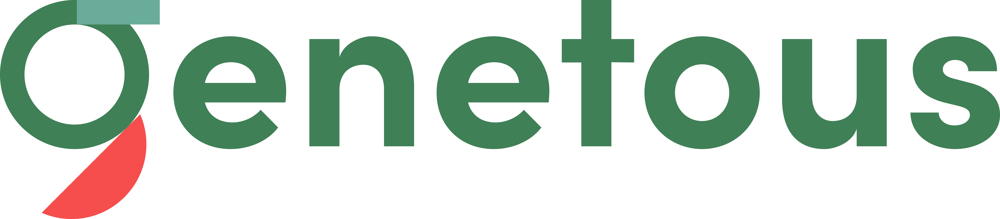

# **Genetous iOS SDK**

**Genetous iOS SDK** is integrated with Genetous Low Code Platform.

**Genetous iOS SDK** allows you to exchange data with services without the need for another tool.

## **Genetous iOS SDK installation**

### **In podfile**

```ruby
pod 'genetousSDK', :git => 'https://github.com/Genetous/genetousiOSSDK.git'
```

### **info.plist**

```xml
    <key>applicationId</key>
    <string>your applicationId</string>
    <key>organizationId</key>
    <string>your organizationId</string>
```

### **Usage sample**

```swift
import genetousSDK

postGetBuilder
    .setJsonPostData(data)
    .setToken(token)
    .setPost_type(POST_TYPE.JSON)
    .setUrlType(URL_TYPE.addCollection.description)
    .setReturn_type(RETURN_TYPE.JSONOBJECT)
    .setHost(host)
    .createPost()
    .process(){response in
        let p=response?.JsonObject
    }
```

Contact us for issues with this SDK!

<http://www.genetous.com>

<info@genetous.com>

### All rights of this SDK reseverd to **Genetous BaaS Platform.**
